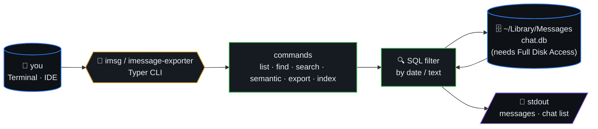
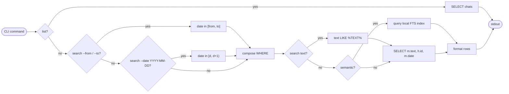
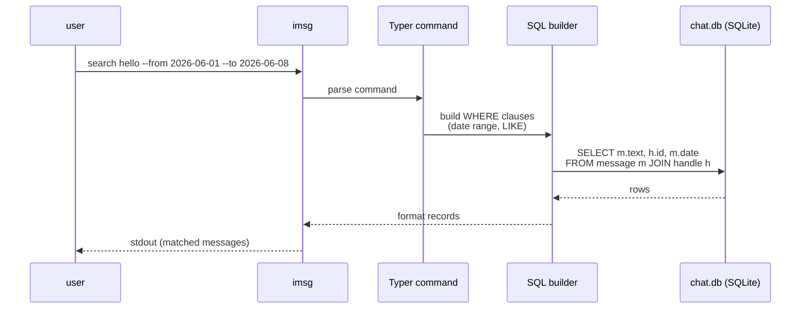
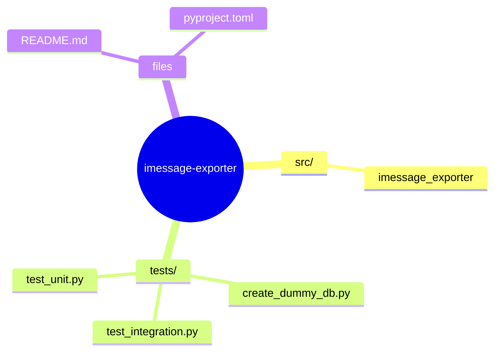
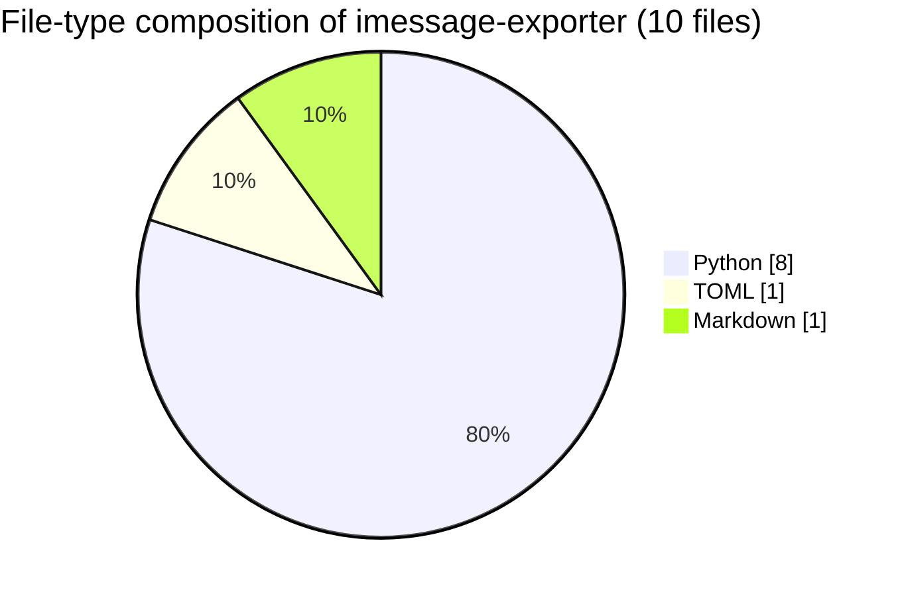

# iMessage Exporter

> A colorful Typer CLI to find, search, and export iMessages from your local
> macOS `chat.db`.

Copyright (c) 2026 Misha Lubich (ml-lubich)

- Website: <https://mishalubich.com>
- GitHub: <https://github.com/ml-lubich>



## Table of contents

- [Installation](#installation)
- [Query flow (sequence)](#query-flow-sequence)
- [Filter algorithm](#filter-algorithm)
- [Usage](#usage)
- [Engineering docs](#engineering-docs)
- [Permissions](#permissions)
- [Repository map](#️-repository-map)
- [Code composition](#-code-composition)

## Filter algorithm



## Query flow (sequence)



## Installation

1. Clone this repository.
2. Install with `uv`:
   ```bash
   uv sync --dev
   ```

Fallback only, if `uv` is unavailable, install in editable mode with `pip`:
   ```bash
   pip install -e .
   ```

## Usage

The package installs two entrypoints:

- `imsg`, the short daily-driver command.
- `imessage-exporter`, the longer memorable project name.

Both commands are the same CLI.

```bash
uv run imsg
imsg -h
```

Use `imsg -h` or `imsg --help` to show the help page.

### List recent chats

```bash
imsg list
imsg list 100
```

You can also list recent messages for a person, phone number, email address, or
chat ID. Partial names work when they resolve to one conversation:

```bash
imsg list "Angel Michel"
imsg list +15106410077
imsg list alice@example.com --limit 50
```

If a partial search matches several contacts or conversations, `imsg list`
prints the options instead of guessing. Use the chat ID, phone, email, or a more
specific name to continue. Very broad searches show a "too many matches" prompt
after 5 contact matches or 10 conversation matches.

### Find a person, phone, email, or chat

```bash
imsg find misha
imsg find 5551234
imsg find alice@example.com
```

### View a conversation page by page

Use `view` when you want to inspect messages before exporting. Page 1 shows the
newest messages by default.

```bash
imsg view "Angel Michel"
imsg view "Angel Michel" --page 2 --page-size 50
imsg view "Angel Michel" --search dinner
imsg view "Angel Michel" --date 2026-06-05
imsg view "Angel Michel" --from 2026-06-01 --to 2026-06-08
```

Add `--output` to export all messages matching the same target and filters while
still printing the current page:

```bash
imsg view "Angel Michel" --search dinner --output ./exports --format yaml
```

### Export

Export by contact name, partial phone/email, exact chat identifier, or chat `ROWID`:

```bash
imsg export "Angel Michel"
imsg export 5551234
imsg export alice@example.com
imsg export 46 --format json
imsg export "Angel Michel" --format csv
imsg export "Angel Michel" --format xlsx
```

By default, `export` writes the full resolved conversation. Add filters when you
only want part of it:

```bash
imsg export "Angel Michel" --search dinner
imsg export "Angel Michel" --date 2026-06-05
imsg export "Angel Michel" --from 2026-06-01 --to 2026-06-08
```

Exports write to the current directory by default with a generated filename like
`imessage-angel-michel-20260605-144530.yaml`.

Use `--output` to choose a file or directory:

```bash
imsg export "Angel Michel" --output ./exports
imsg export "Angel Michel" --output angel-michel.yaml
```

By default, contact exports use direct one-on-one chats for the contact's phone
and email handles. Add `--include-groups` if you also want group chats that
include that contact. Add `--limit` to export only the most recent messages per
chat.

```bash
imsg export "Angel Michel" --include-groups --limit 500
```

Supported export formats:

- `yaml` and `json` preserve the full nested export payload.
- `csv` writes one message per row for spreadsheets and data analysis.
- `xlsx` writes a workbook with `Messages`, `Conversations`, and `Daily Counts`
  sheets so you can quickly sort, filter, and chart activity.

### Search messages

```bash
imsg search hello
imsg search meeting --date 2026-06-05
imsg search --from 2026-06-01 --to 2026-06-08
imsg search meeting --from 2026-06-01 --to 2026-06-08
```

Use `--date` for one calendar day, or `--from` and `--to` for an inclusive
calendar-day range. The text argument is optional, so date-only searches and
text-plus-date searches use the same `search` command.

### Indexed message search

Build a local all-message index from your real Messages database:

```bash
imsg index build
```

Then search that index:

```bash
imsg semantic "plans for dinner"
imsg semantic "flight details" --limit 10
```

The index is stored by default at
`~/Library/Caches/imessage-exporter/search-index.sqlite`. It is a local SQLite
FTS/BM25 index, so it is fast and private, but it is not an external embedding
model. Rebuild it when you want newly arrived messages included:

```bash
imsg index status
imsg index build
```

### Custom database paths

Global options go before the command:

```bash
imsg --db-path ./chat.db list
imsg --contacts-db-path ./AddressBook-v22.abcddb export misha
```

## Permissions

This tool requires **Full Disk Access** for the terminal or IDE running it, as it reads directly from `~/Library/Messages/chat.db`.

## Engineering docs

- [`docs/ARCHITECTURE.md`](docs/ARCHITECTURE.md)
- [`docs/API.md`](docs/API.md)
- [`docs/TESTING.md`](docs/TESTING.md)
- [`docs/RUNBOOK.md`](docs/RUNBOOK.md)
- [`docs/CHANGELOG.md`](docs/CHANGELOG.md)


## 🗺️ Repository map

Top-level layout of `imessage-exporter` rendered as a Mermaid mindmap (auto-generated from the on-disk tree).




## 📊 Code composition

File-type breakdown of source under this repo (skips `.git`, `node_modules`, build caches, lockfiles).


