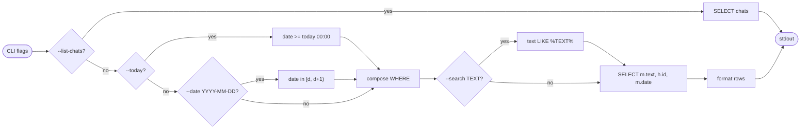
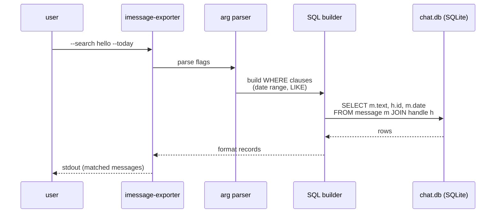
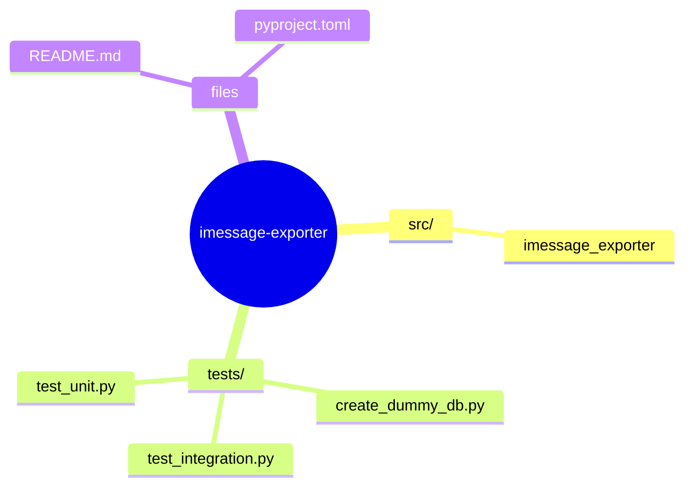
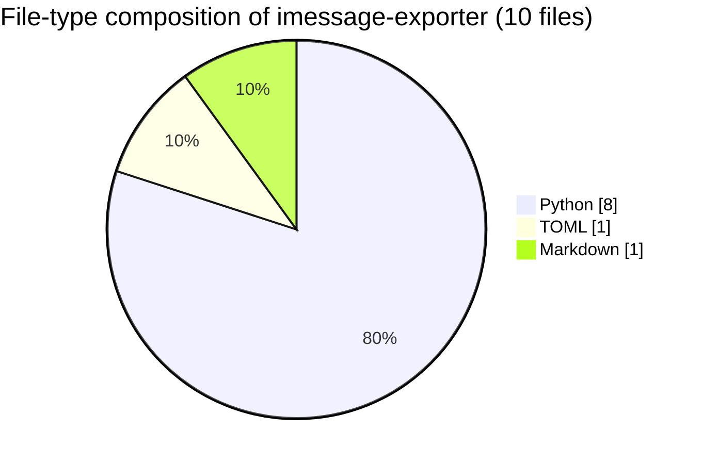

# iMessage Exporter

> A Python tool to search and export iMessages from your local macOS
> `chat.db`.


## Table of contents

- [Installation](#installation)
- [Query flow (sequence)](#query-flow-sequence)
- [Filter algorithm](#filter-algorithm)
- [Usage](#usage)
- [Permissions](#permissions)
- [🗺️ Repository map](#️-repository-map)
- [📊 Code composition](#-code-composition)

## Filter algorithm



## Query flow (sequence)



## Installation

1. Clone this repository.
2. Install in editable mode:
   ```bash
   pip install -e .
   ```

## Usage

The tool provides a CLI command `imessage-exporter`.

### List Recent Chats
```bash
imessage-exporter --list-chats
```

### Search Messages
Search for a specific term:
```bash
imessage-exporter --search "hello"
```

### Filter by Date
Get messages from today:
```bash
imessage-exporter --today
```

Get messages from a specific date:
```bash
imessage-exporter --date 2023-10-27
```

### Combine Filters
Search for "meeting" in messages from today:
```bash
imessage-exporter --search "meeting" --today
```

## Permissions

This tool requires **Full Disk Access** for the terminal or IDE running it, as it reads directly from `~/Library/Messages/chat.db`.


## 🗺️ Repository map

Top-level layout of `imessage-exporter` rendered as a Mermaid mindmap (auto-generated from the on-disk tree).




## 📊 Code composition

File-type breakdown of source under this repo (skips `.git`, `node_modules`, build caches, lockfiles).


