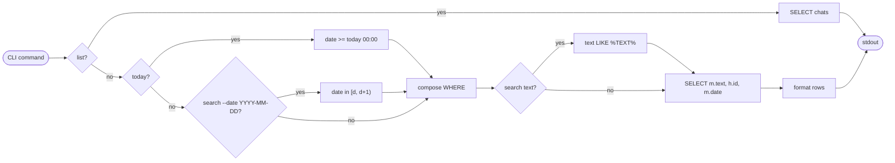
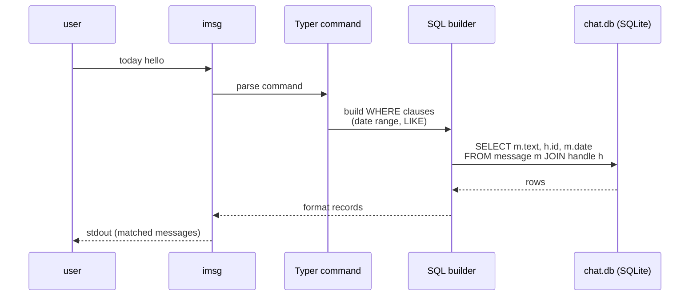
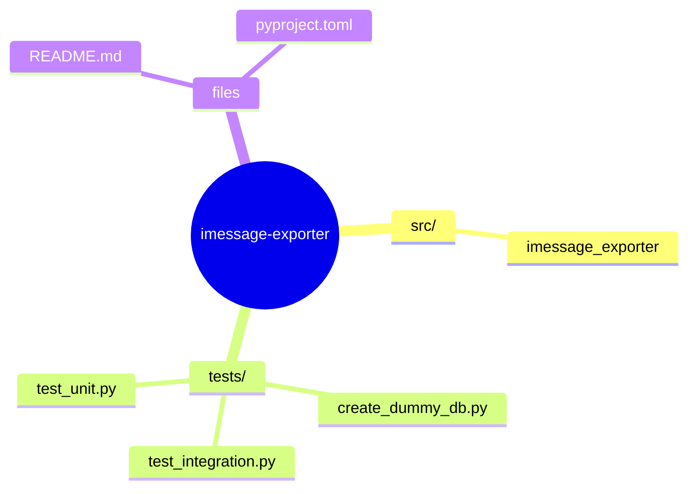
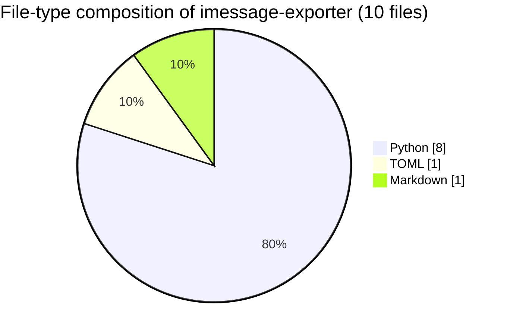

# iMessage Exporter

> A colorful Typer CLI to find, search, and export iMessages from your local
> macOS `chat.db`.

Copyright (c) 2026 Misha Lubich (ml-lubich)

- Website: <https://mishalubich.com>
- GitHub: <https://github.com/ml-lubich>


## Table of contents

- [Installation](#installation)
- [Query flow (sequence)](#query-flow-sequence)
- [Filter algorithm](#filter-algorithm)
- [Usage](#usage)
- [Permissions](#permissions)
- [Repository map](#️-repository-map)
- [Code composition](#-code-composition)

## Filter algorithm



## Query flow (sequence)



## Installation

1. Clone this repository.
2. Install with `uv`:
   ```bash
   uv sync --dev
   ```

You can also install in editable mode with `pip`:
   ```bash
   pip install -e .
   ```

## Usage

The package installs two entrypoints:

- `imsg`, the short daily-driver command.
- `imessage-exporter`, the longer memorable project name.

Both commands are the same CLI.

```bash
uv run imsg
```

### List recent chats

```bash
imsg list
imsg list 100
```

### Find a person, phone, email, or chat

```bash
imsg find misha
imsg find 5551234
imsg find alice@example.com
```

### Export

Export by contact name, partial phone/email, exact chat identifier, or chat `ROWID`:

```bash
imsg export "Angel Michel"
imsg export 5551234
imsg export alice@example.com
imsg export 46 --format json
```

Exports write to the current directory by default with a generated filename like
`imessage-angel-michel-20260605-144530.yaml`.

Use `--output` to choose a file or directory:

```bash
imsg export "Angel Michel" --output ./exports
imsg export "Angel Michel" --output angel-michel.yaml
```

By default, contact exports use direct one-on-one chats for the contact's phone
and email handles. Add `--include-groups` if you also want group chats that
include that contact. Add `--limit` to export only the most recent messages per
chat.

```bash
imsg export "Angel Michel" --include-groups --limit 500
```

### Search messages

```bash
imsg search hello
imsg search meeting --date 2026-06-05
```

### Today

```bash
imsg today
imsg today meeting
imsg today meeting --limit 25
```

### Custom database paths

Global options go before the command:

```bash
imsg --db-path ./chat.db list
imsg --contacts-db-path ./AddressBook-v22.abcddb export misha
```

## Permissions

This tool requires **Full Disk Access** for the terminal or IDE running it, as it reads directly from `~/Library/Messages/chat.db`.


## 🗺️ Repository map

Top-level layout of `imessage-exporter` rendered as a Mermaid mindmap (auto-generated from the on-disk tree).




## 📊 Code composition

File-type breakdown of source under this repo (skips `.git`, `node_modules`, build caches, lockfiles).


